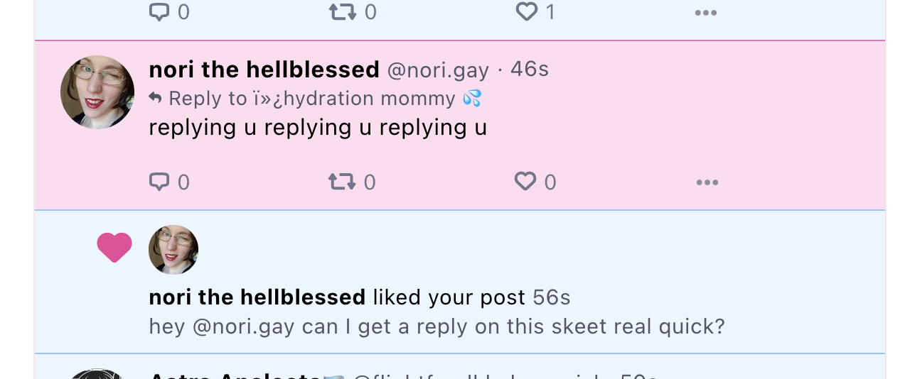
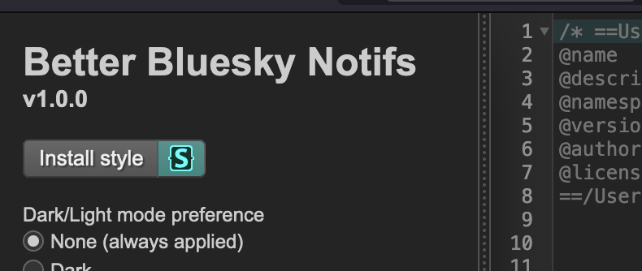
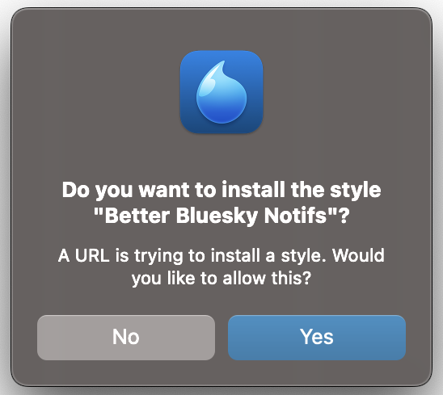
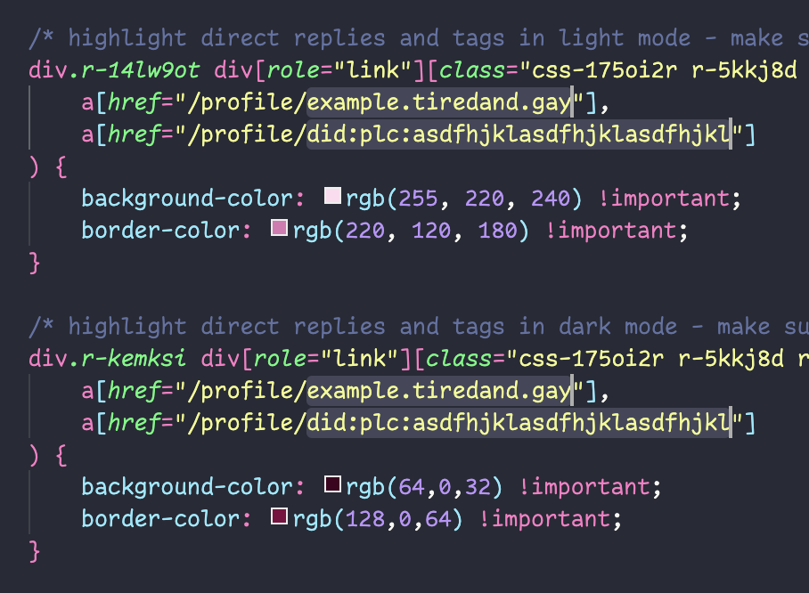

# Better Bluesky Notifs

A set of custom CSS rules to make direct mentions/replies more visible on Bluesky's desktop web interface.

## Demo

## Installation

### Step 1: Install a browser extension to inject custom CSS

This style works best with [Stylus](https://github.com/openstyles/stylus) (Chrome/Firefox/Opera).

For macOS Safari, [Cascadea](https://cascadea.app/) is compatible out-of-the-box.

There's also the popular **Stylish** (Chrome/Firefox/Opera), but there are [compelling reasons against using it](https://robertheaton.com/2018/08/16/stylish-is-back-and-you-still-shouldnt-use-it/) — Stylus was created as a safer alternative after that fiasco.

### Step 1.1: Enable `:has()` feature (Firefox users only)

This userstyle depends on the `:has()` feature, which as of Firefox 103 is disabled behind a feature-flag. You can enable it by visiting [`about:config`](about:config) and enabling the `layout.css.has-selector.enabled` flag.

### Step 2: Install the custom CSS

#### Using Stylus

With Stylus installed, click the above button, and the extension will open a new tab prompting you to add the style:

Then, click the "Install style" button on the left.

#### Using Cascadea

With Cascadea installed, click the above button, and the extension will prompt you to add the style:

Click "Yes"

### Step 3: Update the URLs (EXTREMELY IMPORTANT!)

This userstyle is entirely dependent on your profile's two IDs:
- your domain handle, used to detect direct replies
- your DID, used to detect tags/mentions

Right now, the usercss is using placeholder IDs, you'll need to open the usercss in your extension of choice and replace the profile IDs with your own.

You can find your DID in Bluesky by visiting Settings -> Change My Handle -> I Have My Own Domain, and it'll be visible in the text there.
You don't need to actually change your handle, this is just the easiest way to find your DID!

If you're using Cascadea, the usercss will be read-only if you installed it from the link above, but you can Duplicate the style and edit it from there. The app itself should also explain this.

## Important Note:

This is provided as-is, without any warranty etc.

It's hastily thrown together, and doesn't seem to work 100% of the time. It seems especially temperamental on Firefox right now.
